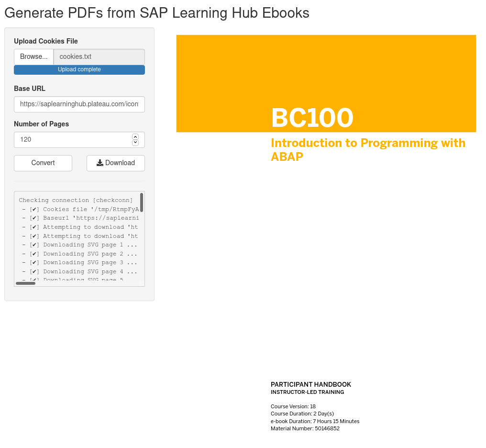

**Generate a PDF from an SAP Learning Hub Ebook**

For usage instructions see `sapebook2pdf --help`.

The *srv* directory contains a single-file Shiny app wrapping the script.
Launch via `make.sh start`.

### Dependencies (sufficient)

 + GNU/Linux
 + `inkscape` < v1.0
 + `pdftk` ≥ v3.0.9

Additional required R packages for Shiny app:

 + shiny
 + shinyjs
 + R.utils
